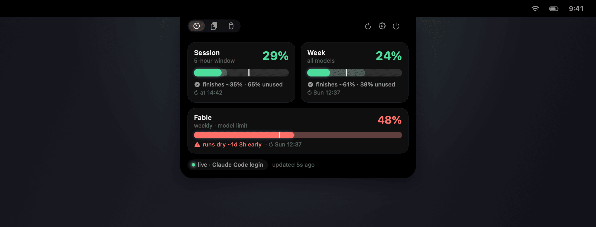

# Cockpit

[](https://github.com/growthforging/cockpit/actions/workflows/build.yml)
[](LICENSE)
[](#install)

A macOS menu-bar app that puts three things in the notch of your MacBook: how much Claude usage you have left, everything you copied recently, and a switch that reverses your mouse wheel while the trackpad keeps scrolling normally.

Hover the notch and it springs open. Click it and it stays open.



Runs on macOS 14 Sonoma and later. The island needs a Mac with a notch: the 14 and 16 inch MacBook Pro from 2021, or the MacBook Air from 2022. Every other Mac gets the same panel from a menu-bar icon instead, with the same readouts on it. That icon also appears whenever a second display is attached.

## Usage

Anthropic publishes three kinds of limit: a 5-hour session window, a weekly window across all models, and weekly windows for individual models. Cockpit reads whichever ones your account has and draws each as a bar with three marks.

Solid fill shows where you are right now. Behind it, a faint band reaches as far as your current burn rate would carry you by the time the window resets. The white tick sits at even pace.

Colour comes from that projection. A bar at 98% two minutes before its reset stays green, since the window refills before the number can hurt you. Leave four hours on the clock at that same 98% and it goes red, with a line underneath telling you how early you run out.

Two of those numbers also sit either side of the notch while the island is closed, so a glance tells you where you stand. Either side can show any window you like, or nothing.

### Where the numbers come from

Cockpit tries three sources in order, and the panel always says which one answered.

1. The login that the Claude Code command line keeps in your Keychain. This is the only source that carries per-model windows.
2. A token from `claude setup-token`, pasted into Settings, or `CLAUDE_CODE_OAUTH_TOKEN` in the environment, which wins over the pasted one. Either way it costs one 1-token ping, and the session and weekly percentages come back in the response headers.
3. Neither of those, in which case Cockpit adds up the cache tokens in your local `~/.claude` transcripts and divides by a fixed budget.

That third one is a guess, and the panel labels it as such. The budget was measured against one particular subscription, so on a different plan the number will be wrong in a direction nobody can predict. Treat it as a rough shape, and connect one of the first two sources for real figures.

## Clipboard

Everything you copy lands in a searchable list. Text and files and images all count, as do screenshots, which Cockpit picks up from wherever macOS saves them. Press Shift-Command-V anywhere to open the list, type to filter, use the arrow keys to move, then press Return to paste into whatever app you came from. Clicking a row copies it and leaves the list open.

Some launchers claim Shift-Command-V first. If yours does, Settings says so and the list still opens from the island.

Apps that mark a copy as concealed are skipped. That marking is voluntary. 1Password and KeePassXC set it, Apple's Passwords app does not, and anything copied through a browser extension arrives as ordinary text and is recorded. Switch recording off before copying a secret.

## Mouse wheel

macOS has one natural-scrolling switch shared by the trackpad and the mouse, which is why plugging in a wheel mouse makes scrolling feel backwards. Cockpit reverses wheel events on their own, and trackpad gestures stay untouched. It ships switched off. Turn it on from the third tab.

## Install

```sh
git clone https://github.com/growthforging/cockpit.git
cd cockpit
./build.sh && cp -R Cockpit.app /Applications/ && open /Applications/Cockpit.app
```

You need Xcode 15.3 or later, for Swift 5.10, or an equivalent Command Line Tools install. `build.sh` compiles, assembles the app bundle, and signs it.

One detail is worth knowing before you grant any permissions. macOS ties Accessibility and Keychain grants to an app's code signature.

If your Keychain holds an Apple Development identity, `build.sh` finds it and uses it, so your grants survive every rebuild. Without one it falls back to an ad-hoc signature, which changes on each build, and macOS quietly stops honouring what you granted. The permission prompt returns after every rebuild.

There is no prebuilt download, on purpose. A binary signed this way arrives quarantined and asks you to defeat Gatekeeper by hand, which is worse than the three commands above.

## Permissions

Cockpit works in some useful form whatever you refuse.

### Accessibility

Reversing wheel events requires it, and so does sending Command-V when you paste from the clipboard list. macOS asks the first time you switch the wheel flip on, then never opens that dialog again by itself. Nothing prompts you at launch. If you refuse, the clipboard list goes on copying when you click a row, and the usage panel is unaffected.

### Keychain

Per-model numbers come from an Anthropic endpoint that needs the login the Claude Code command line stores in your Keychain. macOS asks before Cockpit reads it, and choosing Always Allow means it never asks again.

Access tokens expire after a few hours, and the command line only renews them while it runs. Cockpit therefore renews the login itself through the same endpoint, client id, and scopes, then writes the new pair back so `claude` stays signed in too.

### Notifications

Asked the first time a pace alert would actually fire, which keeps launch quiet. Alerts warn you when your burn rate points at running out before a window resets. Turn them off in Settings and the request never happens.

### Your screenshot folder

Screenshots go wherever you have pointed macOS, usually the Desktop, and macOS asks before any app may read that folder. Cockpit looks there only while screenshot capture is switched on in Settings, so leaving that off means the prompt never arrives. The rest of the clipboard history works either way.

## Privacy

Everything the app sends goes to Anthropic, over three endpoints and nowhere else.

| What it is for | Endpoint |
| --- | --- |
| per-model usage numbers | `api.anthropic.com/api/oauth/usage` |
| one 1-token ping whose response headers carry session and weekly percentages | `api.anthropic.com/v1/messages` |
| renewal of the login, the same call the command line makes | `platform.claude.com/v1/oauth/token` |

Nothing else leaves your Mac. There is no analytics SDK in the binary, and no server of mine for it to talk to. Your clipboard stays local.

State lives in `~/.cockpit`, a directory kept at mode 0700, with every file inside it written 0600 and repaired on launch if something loosened them. Clipboard history sits there as plain JSON beside plain image files, so anything already running as you can read it. Recording has an off switch in Settings, and the history has a Clear button.

Two things are worth naming plainly. Cockpit writes a live access token to `~/.cockpit/claude-code-login.json`, outside the Keychain, because it has to survive a relaunch. It also rewrites the Claude Code Keychain item whenever it renews the login, which is what keeps `claude` signed in.

## Settings

Open Settings from the gear in the island.

Either side of the notch can be pinned to a specific window, so you can watch one model and ignore everything else. The clipboard has a size cap and a switch for screenshot capture. Refreshes happen every 60 seconds by default. Launch at login installs a small LaunchAgent, which Cockpit re-points if you move the app, and switching it off deletes that file.

## When something looks wrong

Cockpit writes down what it did. These three files in `~/.cockpit` hold the answer when the display looks wrong.

| File | What it holds |
| --- | --- |
| `usage-state.json` | which source answered, and what it returned |
| `pace-state.json` | the projection behind each bar |
| `state.json` | what Cockpit believes it drew, and on which screens |

Run `Cockpit.app/Contents/MacOS/Cockpit --notchinfo` to dump screen and notch geometry. `--shot out.png` renders the panel to an image, which is how the picture at the top of this page is made.

A bar showing a dash has no data for that window yet. One reading "measuring pace" has too few samples to project from, which takes a few minutes on the session window and a few hours on a weekly one. Where samples are thin, Cockpit falls back to the window's own average once about 15% of it has elapsed. The local-log estimate carries no reset time at all, so its bars stay on "measuring pace" until you connect one of the other two sources.

When the usage panel reports an expired login, run `claude` once and sign in. Accessibility that looks granted while the wheel keeps scrolling the old way usually means the signature changed underneath it, so remove Cockpit from the Accessibility list and add it back.

## Uninstall

Quit the app, delete it with its folder and login item, then drop its preferences.

```sh
osascript -e 'quit app "Cockpit"'
rm -rf /Applications/Cockpit.app ~/.cockpit ~/Library/LaunchAgents/com.growthforging.cockpit.plist
defaults delete com.growthforging.cockpit
```

Then remove Cockpit from the Accessibility list in System Settings, under Privacy and Security.

## Contributing

Issues and pull requests are welcome. The code is about 4,000 lines of Swift with no dependencies, one concern per file. `UsageService` and `Pace` produce the numbers, `Clipboard` keeps the history, the event tap lives in `ScrollFlip`, and the window itself is `NotchHUD` plus `IslandView`.

Build with `./build.sh`. It fails loudly when the toolchain is unhappy, so a stale bundle never reaches `/Applications`.

## Credit

The scroll-reversal event tap comes from ScrollFlip, and the usage projection from MaxBar, two earlier apps of mine that Cockpit replaces.

## License

Released under the MIT License. See [LICENSE](LICENSE) for the text.
